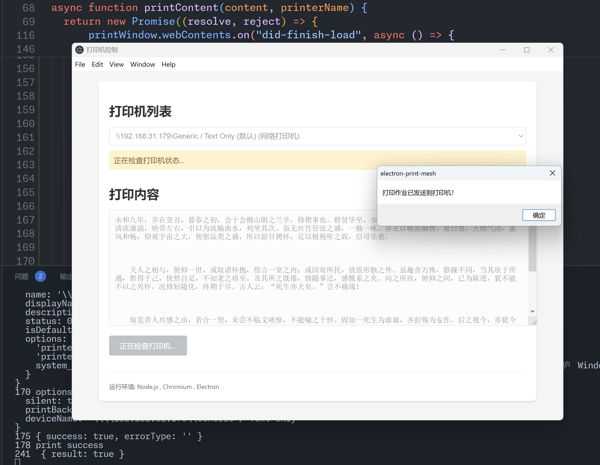
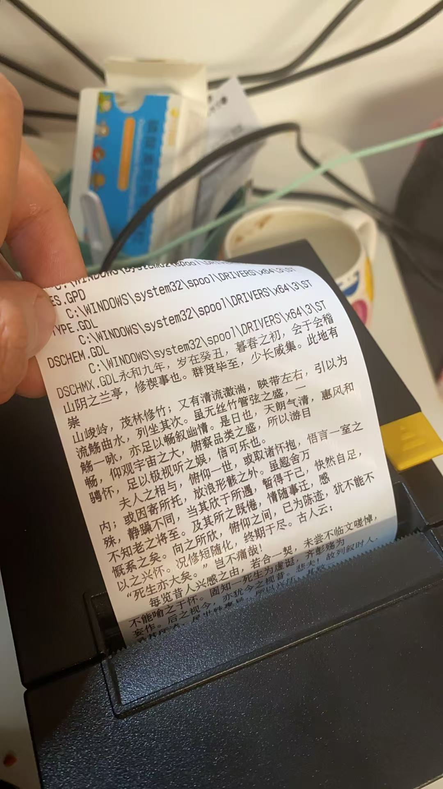

# electron-print-mesh

一个基于Electron开发的打印机调用演示应用，用于展示如何在Electron应用中实现打印机控制功能。

## 功能特点
- 自动获取系统中已连接的打印机列表
- 支持本地打印机和网络打印机
- 实时打印机状态检测
- 提供打印预览功能
- 完整的错误处理机制

## 运行效果
### 应用界面


### 打印效果


## 安装使用
### 环境要求
- Node.js
- pnpm

### 安装步骤
```bash
# 安装依赖
pnpm install

# 启动应用
pnpm start
```

## 技术实现
- 使用Electron的原生打印API
- IPC通信实现主进程和渲染进程的打印控制
- 支持多种打印机类型的连接检测
- 完整的错误处理和状态反馈机制

## 许可证
本项目采用 [MIT](LICENSE.md) 开源许可证。
